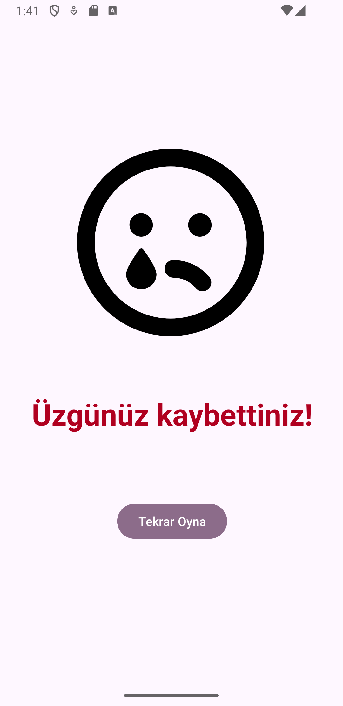

# Number Guessing Project

## Introduction

The Number Guessing Project is an interactive Android application where users can guess a number within a specified range. The app utilizes fragments and the Navigation Component to manage and exchange data between different parts of the app. This project demonstrates the use of Android architecture components for seamless and efficient navigation and data handling.

## Screenshots

### Main Screen


### Guess Screen


### Result Screen


### Settings Screen


### About Screen


## Installation

To get a local copy up and running follow these simple steps:

1. Clone the repo
   ```sh
   git clone https://github.com/yourusername/number-guessing-app.git


# Screenshots

## Screenshot 1


## Screenshot 2


## Screenshot 3


## Screenshot 4


## Screenshot 5

